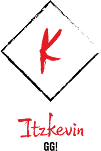

# Road to Senior Skills - Learning path

Esta es una ruta de aprendizaje la cual cumple como objetivo dejar documentado todo mi proceso de aprendizaje sobre programación **Front - End**, Llevando mis conocimientos prácticos a conocimientos mas técnicos.

## Contenido

* 🎃Versionamiento (GIT) 
* 🎨Estilos Gráficos UI 
* 📚Frameworks, Librerías etc 
* ⌨Lógica de Programación 
* ⚙Comunicación y Persistencia 
* 🛠Codificación 
* 📀Principios de Software 

---
## Objetivo

El objetivo principal con esta ruta de aprendizaje es afinar y pulir mis conocimiento, y mejorar técnicamente los conocimientos que uso día a día.

  

